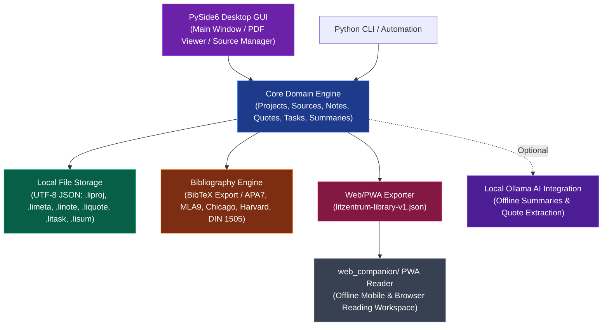

# LitZentrum

**[Deutsch](README_de.md)** · English

[](LICENSE)
[](https://python.org)
[](https://github.com/doc-bricks/LitZentrum)
[](CHANGELOG.md)
[](tests)
[](llms.txt)
[](https://github.com/doc-bricks)
[](https://github.com/open-bricks)

**Local-first literature management for academic writing.**

> [!NOTE]
> **AI & Agent Integration**: LitZentrum provides machine-readable JSON Schemas (`schemas/litzentrum-library-v1.schema.json`) and an explicit `llms.txt` context specification for AI agents, citation generation, and local-first research automation workflows.

LitZentrum is a desktop application for managing academic literature in plain project folders. It combines local JSON-based storage, PDF handling, notes, quotes, tasks, summaries, BibTeX export and optional local AI support through Ollama.

## Start Here

| Goal | Entry point |
|---|---|
| Manage literature in local project folders | `python src/main.py` |
| Track sources, notes, quotes, tasks and summaries | `src/core/` and `src/gui/` |
| Export citations for academic writing | BibTeX export and citation styles |
| Review a library on mobile without shipping PDFs | `web_companion/` with `litzentrum-library-v1.json` |
| Inspect data contracts for agent or tool integration | `schemas/litzentrum-library-v1.schema.json` and `EXPORTFORMAT.md` |

## System Architecture



## Discovery Context

LitZentrum is best described as a local-first literature manager, offline bibliography manager, PDF-backed academic writing workspace, and PySide6 research tool. It is intentionally different from cloud reference managers, hosted reading platforms and team citation services: projects stay in normal folders, exports are explicit, and the Web/PWA companion receives a redacted JSON bundle instead of full PDF libraries.

If you are comparing tools, use LitZentrum when you want a local alternative around PDF files, BibTeX, notes, quotes, task tracking and optional local Ollama support. It is not a Zotero, Mendeley or JabRef clone, not a Calibre e-book library, and not a cloud sync or institutional library portal.

## Features

- Folder-based library structure: each source lives in its own directory.
- PDF integration: import, preview, text extraction and full-text workflows.
- Notes and quotes: page references, tags and categories.
- Task management: project-wide and per-source tasks.
- Summaries: manual or optionally AI-assisted.
- Bibliography: BibTeX export and multiple citation styles.
- Companion export: `litzentrum-library-v1.json` for read-only Web/PWA readers without embedded PDF binaries.
- Optional AI integration: local processing with Ollama.
- Git-friendly project layout for versioned research work.
- Static `web_companion/` reader for offline import, search and citation copy on mobile browsers.

## Screenshots


## Installation

```bash
git clone https://github.com/doc-bricks/LitZentrum.git
cd LitZentrum
pip install -r requirements.txt
python src/main.py
```

## Requirements

- Python 3.10+
- PySide6
- PyMuPDF
- bibtexparser
- jsonschema
- requests, only for optional Ollama integration

## Project Structure

```text
LitZentrum/
+-- src/
|   +-- main.py                 # Entry point
|   +-- core/                   # Project, source and export logic
|   +-- formats/                # .li* JSON file formats
|   +-- gui/                    # PySide6 user interface
|   +-- modules/                # Bibliography, PDF, AI and sync modules
+-- schemas/                    # JSON schemas
+-- tests/                      # Regression tests
+-- resources/                  # Icons and static assets
```

## File Formats

All project data is stored as UTF-8 JSON:

| Format | Description |
|---|---|
| `.liproj` | Project configuration |
| `.limeta` | Source metadata |
| `.linote` | Notes |
| `.liquote` | Quotes |
| `.litask` | Tasks |
| `.lisum` | Summaries |
| `litzentrum-library-v1.json` | Read-only companion export bundle |

The companion export contains projects, sources, metadata, notes, quotes, tasks, summaries and BibTeX. It does not include PDF files, PDF binary data or absolute local paths.

## Project Layout

```text
MyProject/
+-- projekt_config.liproj
+-- projekt_tasks.litask
+-- projekt_notes.linote
+-- Quellen/
|   +-- Smith2023_Understanding_AI/
|   |   +-- meta.limeta
|   |   +-- notes.linote
|   |   +-- quotes.liquote
|   |   +-- tasks.litask
|   |   +-- summaries.lisum
|   |   +-- source.pdf
|   +-- Doe2024_Machine_Learning/
|       +-- ...
```

## Citation Styles

- APA 7
- MLA 9
- Chicago
- DIN 1505-2
- Harvard

## Optional AI Integration

LitZentrum can use a local Ollama installation for optional AI-assisted summaries, quote extraction and metadata support.

```bash
ollama run mistral
```

## Development

```bash
pip install -r requirements.txt
python -m pytest -q
python -m py_compile src/main.py
python tests/source_platform_smoke.py
python -m pytest -q tests/test_store_materials.py
node --test web_companion/tests/library.test.mjs
node --test web_companion/tests/mobile-pwa.test.mjs
node --check web_companion/sw.js
```

## Web/PWA Companion

The `web_companion/` folder contains a static offline reader for `litzentrum-library-v1.json`.
It supports local import, search across metadata/notes/quotes/tasks/summaries, citation copy,
service-worker caching, local restore of the last loaded bundle and a mobile PWA preflight for
Android/iOS install readiness, offline navigation and touch-target checks.

## Platform Source Smoke

`tests/source_platform_smoke.py` verifies the source install path used by macOS
and Linux users. It creates and reopens a temporary project, displays one source
through the offscreen GUI path, exports BibTeX and validates
`litzentrum-library-v1.json`. The GitHub workflow
`.github/workflows/platform-smoke.yml` runs the same smoke on Ubuntu and macOS.

## Windows EXE Build

`build_exe.bat` builds a direct Windows desktop EXE locally under
`C:\_Local_DEV\codex_build\litzentrum`, uses the shared
`_tools/build_exclude_scanner.py`, refreshes `dist\LitZentrum.exe` and writes
`releases\v1.0.0\LitZentrum-1.0.0-win64.exe` plus `SHA256SUMS.txt`.
The Store-specific EXE/MSIX path remains
`releases/windowsstore/build_store_release.ps1`.

## Windows Store

`store_package.json`, `STORE_LISTING.md`, `PRIVACY_POLICY.md`, `SUPPORT.md`,
`WINDOWS_STORE_PREP.md` and `releases/windowsstore/build_store_release.ps1`
capture the current Windows Store path for LitZentrum. The current state now
covers public metadata, support/privacy pages, a reproducible four-image Store
screenshot set under `README/screenshots/store/`, generated Store logo assets,
a reproducible local EXE/MSIX build path, a passing pre-submission test run and
a local MSIX artifact. The remaining explicit Store gate is the elevated WACK
run plus the later Partner Center submission.

## License

AGPL v3. See [LICENSE](LICENSE).

This project uses PySide6 (LGPL) and PyMuPDF (AGPL).

## Liability

This project is an unpaid open-source donation. Liability is limited to intent and gross negligence under Section 521 of the German Civil Code. Use at your own risk. No warranty, maintenance guarantee or fitness-for-purpose is assumed.
