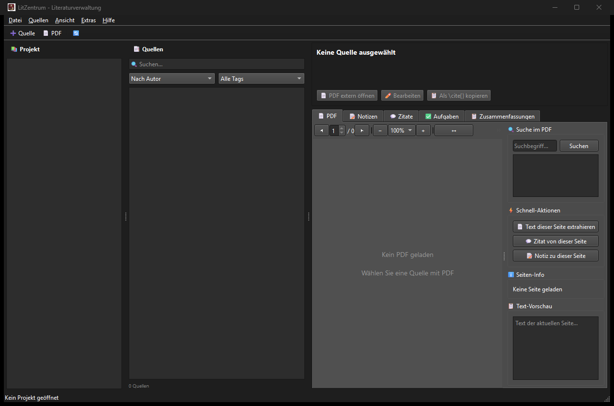

# LitZentrum

Deutsch · **[English](README.md)**

[](LICENSE)
[](https://python.org)
[](https://github.com/doc-bricks/LitZentrum)
[](CHANGELOG.md)

**Ordnerbasierte Literaturverwaltung für wissenschaftliches Schreiben.**

LitZentrum ist eine Desktop-Anwendung zur Verwaltung akademischer Literatur in lokalen Projektordnern. Die Anwendung verbindet UTF-8-JSON-Speicherformate, PDF-Workflows, Notizen, Zitate, Aufgaben, Zusammenfassungen, BibTeX-Export und optionale lokale KI-Unterstützung über Ollama.

## Einstieg

| Ziel | Einstieg |
|---|---|
| Literatur in lokalen Projektordnern verwalten | `python src/main.py` |
| Quellen, Notizen, Zitate, Aufgaben und Zusammenfassungen pflegen | `src/core/` und `src/gui/` |
| Zitationen für wissenschaftliche Texte exportieren | BibTeX-Export und Zitierstile |
| Bibliothek mobil prüfen, ohne PDFs weiterzugeben | `web_companion/` mit `litzentrum-library-v1.json` |
| Datenverträge für Agenten oder Tools prüfen | `schemas/litzentrum-library-v1.schema.json` und `EXPORTFORMAT.md` |

## Auffindbarkeit und Abgrenzung

LitZentrum ist am besten als lokale Literaturverwaltung, Offline-Bibliografiemanager, PDF-gestützter Schreibarbeitsplatz und PySide6-Forschungstool beschrieben. Das Projekt ist bewusst anders aufgebaut als Cloud-Referenzmanager, gehostete Leseplattformen oder Team-Zitationsdienste: Projekte bleiben in normalen Ordnern, Exporte sind explizit, und der Web/PWA-Companion erhält ein redigiertes JSON-Bündel statt kompletter PDF-Bibliotheken.

Für Toolvergleiche passt LitZentrum, wenn lokale PDF-Dateien, BibTeX, Notizen, Zitate, Aufgaben und optionale lokale Ollama-Unterstützung wichtiger sind als Cloud-Sync. Es ist kein Zotero-, Mendeley- oder JabRef-Klon, keine Calibre-E-Book-Bibliothek und kein institutionelles Bibliotheksportal.

## Funktionen

- Ordnerbasiertes System: jede Quelle liegt in einem eigenen Ordner.
- PDF-Integration: Import, Vorschau, Textextraktion und Volltext-Workflows.
- Notizen und Zitate: Seitenverweise, Tags und Kategorien.
- Aufgabenverwaltung: projektweit und pro Quelle.
- Zusammenfassungen: manuell oder optional KI-gestützt.
- Bibliografie: BibTeX-Export und mehrere Zitierstile.
- Companion-Export: `litzentrum-library-v1.json` für read-only Web/PWA-Reader ohne PDF-Binärdaten.
- Statischer `web_companion/`-Reader für Offline-Import, Suche und Zitierkopie im Browser.
- Mobile-PWA-Preflight für Android/iOS-Installierbarkeit, Offline-Navigation und Touch-Ziele.
- Optionale KI-Integration: lokale Verarbeitung mit Ollama.
- Git-freundliches Projektlayout für versionierte Forschungsarbeit.

## Screenshots



## Installation

```bash
git clone https://github.com/doc-bricks/LitZentrum.git
cd LitZentrum
pip install -r requirements.txt
python src/main.py
```

## Voraussetzungen

- Python 3.10+
- PySide6
- PyMuPDF
- bibtexparser
- jsonschema
- requests, nur für die optionale Ollama-Integration

## Projektstruktur

```text
LitZentrum/
+-- src/
|   +-- main.py                 # Einstiegspunkt
|   +-- core/                   # Projekt-, Quellen- und Exportlogik
|   +-- formats/                # .li*-JSON-Dateiformate
|   +-- gui/                    # PySide6-Oberfläche
|   +-- modules/                # Bibliografie, PDF, KI und Sync
+-- schemas/                    # JSON-Schemas
+-- tests/                      # Regressionstests
+-- resources/                  # Icons und statische Assets
```

## Dateiformate

Alle Projektdaten werden als UTF-8-JSON gespeichert:

| Format | Beschreibung |
|---|---|
| `.liproj` | Projektkonfiguration |
| `.limeta` | Quellenmetadaten |
| `.linote` | Notizen |
| `.liquote` | Zitate |
| `.litask` | Aufgaben |
| `.lisum` | Zusammenfassungen |
| `litzentrum-library-v1.json` | Read-only Companion-Exportbündel |

Der Companion-Export enthält Projekte, Quellen, Metadaten, Notizen, Zitate, Aufgaben, Zusammenfassungen und BibTeX. Er enthält keine PDF-Dateien, keine PDF-Binärdaten und keine absoluten lokalen Pfade.

## Projektlayout

```text
MeinProjekt/
+-- projekt_config.liproj
+-- projekt_tasks.litask
+-- projekt_notes.linote
+-- Quellen/
|   +-- Smith2023_Understanding_AI/
|   |   +-- meta.limeta
|   |   +-- notes.linote
|   |   +-- quotes.liquote
|   |   +-- tasks.litask
|   |   +-- summaries.lisum
|   |   +-- source.pdf
|   +-- Doe2024_Machine_Learning/
|       +-- ...
```

## Zitierstile

- APA 7
- MLA 9
- Chicago
- DIN 1505-2
- Harvard

## Optionale KI-Integration

LitZentrum kann eine lokale Ollama-Installation für optionale KI-gestützte Zusammenfassungen, Zitatextraktion und Metadatenunterstützung verwenden.

```bash
ollama run mistral
```

## Entwicklung

```bash
pip install -r requirements.txt
python -m pytest -q
python -m py_compile src/main.py
python tests/source_platform_smoke.py
python -m pytest -q tests/test_store_materials.py
node --test web_companion/tests/library.test.mjs
node --test web_companion/tests/mobile-pwa.test.mjs
node --check web_companion/sw.js
```

## Web/PWA-Companion

Der Ordner `web_companion/` enthält jetzt einen statischen Offline-Reader für
`litzentrum-library-v1.json`. Er unterstützt lokalen Import, Suche über
Metadaten/Notizen/Zitate/Aufgaben/Zusammenfassungen, Zitierkopie, Service Worker
und die Wiederherstellung der zuletzt geladenen Bibliothek. Zusätzlich prüft ein
mobiler PWA-Preflight Android-/iOS-Installierbarkeit, Offline-Navigation und
Touch-Ziele. Echte Geräte-Smokes bleiben vor einer Release-Entscheidung separat
zu prüfen.

## Plattform-Source-Smoke

`tests/source_platform_smoke.py` prüft den Source-Installationspfad für macOS-
und Linux-Nutzer. Der Smoke legt ein temporäres Projekt an, öffnet es erneut,
zeigt eine Quelle über den Offscreen-GUI-Pfad an, exportiert BibTeX und validiert
`litzentrum-library-v1.json`. Der GitHub-Workflow
`.github/workflows/platform-smoke.yml` führt denselben Smoke auf Ubuntu und macOS
aus.

## Windows Store

`store_package.json`, `STORE_LISTING.md`, `PRIVACY_POLICY.md`, `SUPPORT.md`,
`WINDOWS_STORE_PREP.md` und `releases/windowsstore/build_store_release.ps1`
halten jetzt den aktuellen Windows-Store-Pfad für LitZentrum fest. Der jetzige
Stand deckt öffentliche Metadaten, Datenschutz- und Supportseiten, dedizierte
Store-Screenshots, generierte Store-Logo-Assets, einen reproduzierbaren lokalen
Windows-EXE-/MSIX-Buildpfad, einen bestandenen Pretest und ein lokales
MSIX-Artefakt ab. Das nächste explizite Store-Gate ist der erhöhte WACK-Lauf
sowie danach der Partner-Center-Eintrag.

## Lizenz

AGPL v3. Siehe [LICENSE](LICENSE).

Dieses Projekt verwendet PySide6 (LGPL) und PyMuPDF (AGPL).

## Haftung

Dieses Projekt ist eine unentgeltliche Open-Source-Schenkung im Sinne der §§ 516 ff. BGB. Die Haftung des Urhebers ist gemäß § 521 BGB auf Vorsatz und grobe Fahrlässigkeit beschränkt.

Nutzung auf eigenes Risiko. Keine Wartungszusage, keine Verfügbarkeitsgarantie, keine Gewähr für Fehlerfreiheit oder Eignung für einen bestimmten Zweck.
