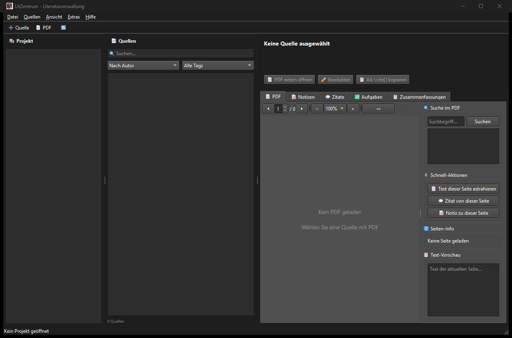

# LitZen

[English](README.md) · [Deutsch](README_de.md) · [Español](README_es.md) · [中文](README_zh.md) · [日本語](README_ja.md) · **Русский**

*Перевод выполнен с помощью машинного перевода; приоритетной является английская версия README.*

[](LICENSE)
[](https://python.org)
[](https://github.com/doc-bricks/LitZentrum)
[](CHANGELOG.md)

**Локальное управление литературой для академического письма.**

LitZen — это настольное приложение для управления академической литературой в обычных папках проектов. Оно объединяет локальное хранилище на основе JSON, работу с PDF, заметки, цитаты, задачи, краткие конспекты, экспорт в BibTeX и необязательную локальную поддержку ИИ через Ollama.

## С чего начать

| Цель | Точка входа |
|---|---|
| Управлять литературой в локальных папках проектов | `python src/main.py` |
| Отслеживать источники, заметки, цитаты, задачи и конспекты | `src/core/` и `src/gui/` |
| Экспортировать цитаты для академического письма | Экспорт в BibTeX и стили цитирования |
| Просматривать библиотеку на мобильном устройстве без передачи PDF | `web_companion/` вместе с `litzentrum-library-v1.json` |
| Изучить контракты данных для интеграции с агентами или инструментами | `schemas/litzentrum-library-v1.schema.json` и `EXPORTFORMAT.md` |

## Контекст для поиска

LitZen лучше всего описывать как локальный менеджер литературы, офлайн-менеджер библиографии, рабочее пространство для академического письма на основе PDF и исследовательский инструмент на PySide6. Он намеренно отличается от облачных менеджеров ссылок, онлайн-платформ для чтения и сервисов командного цитирования: проекты хранятся в обычных папках, экспорт выполняется явно, а Web/PWA-компаньон получает обезличенный JSON-пакет вместо полных библиотек PDF.

Если вы сравниваете инструменты, выбирайте LitZen, когда вам нужна локальная альтернатива, построенная вокруг PDF-файлов, BibTeX, заметок, цитат, отслеживания задач и необязательной локальной поддержки Ollama. Это не клон Zotero, Mendeley или JabRef, не библиотека электронных книг вроде Calibre и не облачная синхронизация или портал институциональной библиотеки.

## Возможности

- Структура библиотеки на основе папок: каждый источник находится в собственном каталоге.
- Интеграция с PDF: импорт, предварительный просмотр, извлечение текста и рабочие процессы с полным текстом.
- Заметки и цитаты: ссылки на страницы, теги и категории.
- Управление задачами: задачи на уровне проекта и отдельных источников.
- Конспекты: вручную или, по желанию, с помощью ИИ.
- Библиография: экспорт в BibTeX и несколько стилей цитирования.
- Экспорт для компаньона: `litzentrum-library-v1.json` для Web/PWA-читалок только для чтения, без встроенных бинарных PDF.
- Необязательная интеграция с ИИ: локальная обработка с помощью Ollama.
- Структура проекта, удобная для Git, для версионируемой исследовательской работы.
- Статическая читалка `web_companion/` для офлайн-импорта, поиска и копирования цитат в мобильных браузерах.

## Скриншоты



## Установка

```bash
git clone https://github.com/doc-bricks/LitZentrum.git
cd LitZentrum
pip install -r requirements.txt
python src/main.py
```

## Требования

- Python 3.11+
- PySide6
- PyMuPDF
- bibtexparser
- jsonschema
- requests, только для необязательной интеграции с Ollama

## Структура проекта

```text
LitZentrum/
+-- src/
|   +-- main.py                 # Entry point
|   +-- core/                   # Project, source and export logic
|   +-- formats/                # .li* JSON file formats
|   +-- gui/                    # PySide6 user interface
|   +-- modules/                # Bibliography, PDF, AI and sync modules
+-- schemas/                    # JSON schemas
+-- tests/                      # Regression tests
+-- resources/                  # Icons and static assets
```

## Форматы файлов

Все данные проекта хранятся в виде JSON в кодировке UTF-8:

| Формат | Описание |
|---|---|
| `.liproj` | Конфигурация проекта |
| `.limeta` | Метаданные источника |
| `.linote` | Заметки |
| `.liquote` | Цитаты |
| `.litask` | Задачи |
| `.lisum` | Конспекты |
| `litzentrum-library-v1.json` | Пакет экспорта для компаньона, только для чтения |

Экспорт для компаньона содержит проекты, источники, метаданные, заметки, цитаты, задачи, конспекты и BibTeX. Он не включает PDF-файлы, бинарные данные PDF или абсолютные локальные пути.

## Структура проекта на диске

```text
MyProject/
+-- projekt_config.liproj
+-- projekt_tasks.litask
+-- projekt_notes.linote
+-- Quellen/
|   +-- Smith2023_Understanding_AI/
|   |   +-- meta.limeta
|   |   +-- notes.linote
|   |   +-- quotes.liquote
|   |   +-- tasks.litask
|   |   +-- summaries.lisum
|   |   +-- source.pdf
|   +-- Doe2024_Machine_Learning/
|       +-- ...
```

## Стили цитирования

- APA 7
- MLA 9
- Chicago
- DIN 1505-2
- Harvard

## Необязательная интеграция с ИИ

LitZen может использовать локально установленный Ollama для необязательных конспектов с помощью ИИ, извлечения цитат и поддержки работы с метаданными.

```bash
ollama run mistral
```

## Разработка

```bash
pip install -r requirements.txt
python -m pytest -q
python -m py_compile src/main.py
python tests/source_platform_smoke.py
python -m pytest -q tests/test_store_materials.py
node --test web_companion/tests/library.test.mjs
node --test web_companion/tests/mobile-pwa.test.mjs
node --check web_companion/sw.js
```

Проверено 2026-10-04: пройдены 74 теста Python, платформенный smoke-тест исходников и 25
тестов Web Companion.

## Web/PWA-компаньон

Папка `web_companion/` содержит статическую офлайн-читалку для `litzentrum-library-v1.json`.
Она поддерживает локальный импорт, поиск по метаданным, заметкам, цитатам, задачам и конспектам,
копирование цитат, кэширование через service worker, локальное восстановление последнего загруженного пакета
и мобильную PWA-предпроверку готовности к установке на Android/iOS, офлайн-навигации
и размеров элементов для касания.

## Платформенный smoke-тест исходников

`tests/source_platform_smoke.py` проверяет путь установки из исходников, которым пользуются
пользователи macOS и Linux. Он создаёт и заново открывает временный проект, отображает один источник
через офлайн-путь GUI (offscreen), экспортирует BibTeX и проверяет
`litzentrum-library-v1.json`. Рабочий процесс GitHub
`.github/workflows/platform-smoke.yml` запускает тот же smoke-тест в Ubuntu и macOS.

## Windows Store

`store_package.json`, `STORE_LISTING.md`, `PRIVACY_POLICY.md`, `SUPPORT.md`,
`WINDOWS_STORE_PREP.md` и `generate_store_screenshots.py` фиксируют текущую
базовую подготовку LitZen к Windows Store. Текущее состояние охватывает публичные метаданные,
страницы поддержки и конфиденциальности, а также воспроизводимый набор из четырёх скриншотов для магазина в
`README/screenshots/store/`. Воспроизводимый путь сборки Windows EXE/MSIX и WACK
остаются следующими явными шагами.

## Лицензия

AGPL v3. См. [LICENSE](LICENSE).

Этот проект использует PySide6 (LGPL) и PyMuPDF (AGPL).

## Ответственность

Этот проект является безвозмездным пожертвованием в виде программного обеспечения с открытым исходным кодом. Ответственность ограничена умыслом и грубой неосторожностью в соответствии с § 521 Германского гражданского уложения. Используйте на свой страх и риск. Никакие гарантии, обязательства по сопровождению или пригодность для определённой цели не предполагаются.
